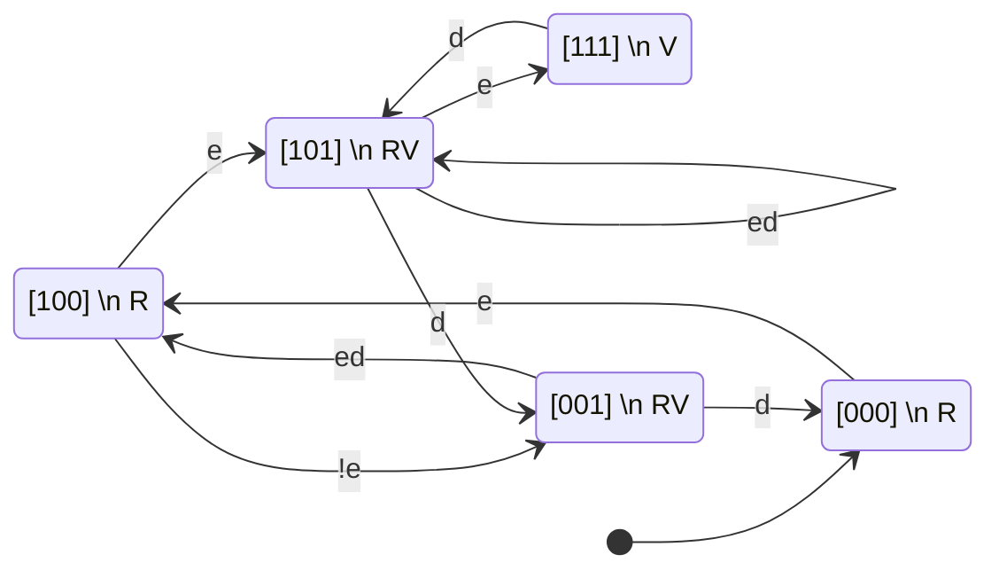
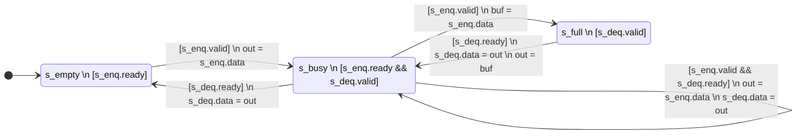

# An Idiosyncratic Guide to Chisel

## Prerequisites

## Primitives

### Skid Buffer

## Final Project

As the final project, we will implement a `memset` block. Given a start addres, size 

Memset block. 

* AXI4-Lite register interface
* Command FIFO
* Interrupt 
* Write to memory using Xilinx' AXI DataMover

In the next iteration, maybe even implement a full-fledged high-performance bursting AXI4 master.

Chisel Cheatsheet

# Scala

Objects
Classes
Companion objects
Implicit classes (adding methods to existing classes)
Functions
Lambdas and closures
Types
Type Inference
Seq
.foreach
.map

# Basic features to demonstrate

Inputs
Outputs
Types:
    * Bool
    * UInt
    * Bundles
    * Vec/VecInit
    * .U
    * .W
Directions:
    * Input
    * Output
    * Flipped
Modules:
    * Instantiation (Module(new ...))
Combinational stuff:
    * Boolean operators
    * Mux
    * Cat
    * extract bits
    * asUInt(), asTypeOf(), 
    * when/elsewhen/otherwise
    * Wire/WireInit/
    * arithmetic
Sequential
    * RegInit
    * state machines

Connect:
    <>
    :=

Last connection takes precedence

mention memories

difference between chisel and scala types (a chilsel type is an instance of a scala type)

.cloneType
chiselTypeOf
log2Ceil

# Generators

syntactic sugar for generators:

e.g. 

when( c0 ) {
    when( c1 ) {
        a := b
    }.otherwise {
        a := c
    }
}.otherwise {
    a := d
}

maintains a context of the current condition

Difference between if and when
That `for` runs during generation, not in hardware

# Streams

Basic bundle
Basic functions (enq, deq)
Add basic sources (Source, Input, Output)
Buffer // InlineInstance
.buf/.rbuf
.transform
.transform (do on the first cycle of beat)
.split()
Vec.join() 
.join_with()
.join(s){}
.skid()

.axis()
.from_axis()

.iterator
.reduce

.fifo (no need to implement)

Consider:
    Stage
    .staget()

# Simple AXI Stream Design

# sequence

* Hello world (trivial module z := x + y)
* 
* Streams
* 

# AXI4-Lite Register File 

## Requirements:

* High throughput: sustaine 1 read per cycle 
* 

# Projects:

Wrapper around DataMover (split a transaction into multiple DM commands)

## memset 1

DMA -> memset <-> DataMover 

## memset 2

axi lite -> memset <-> datamover

