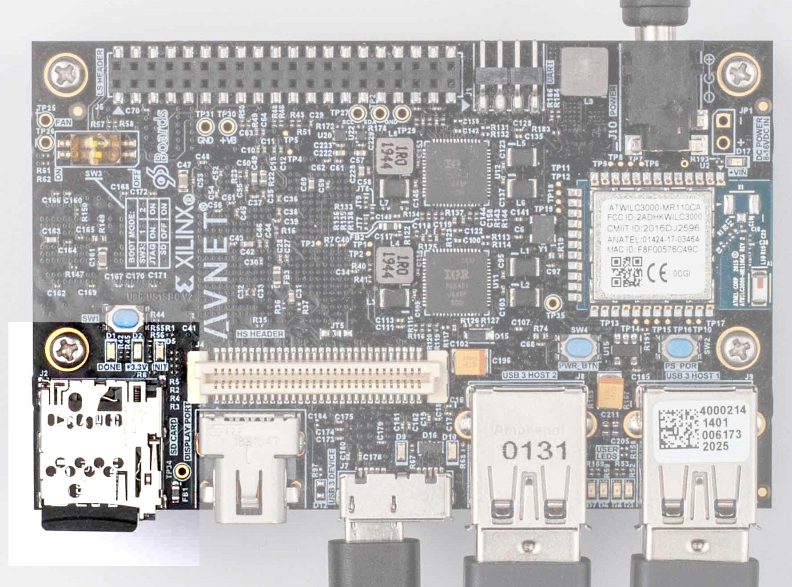
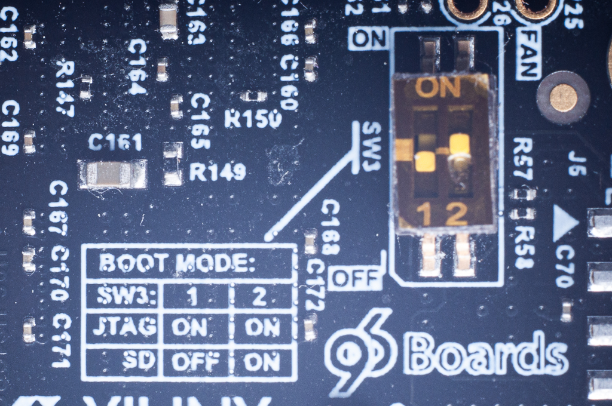
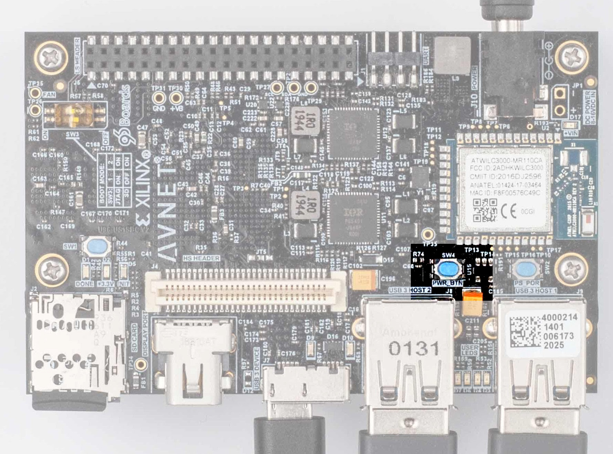
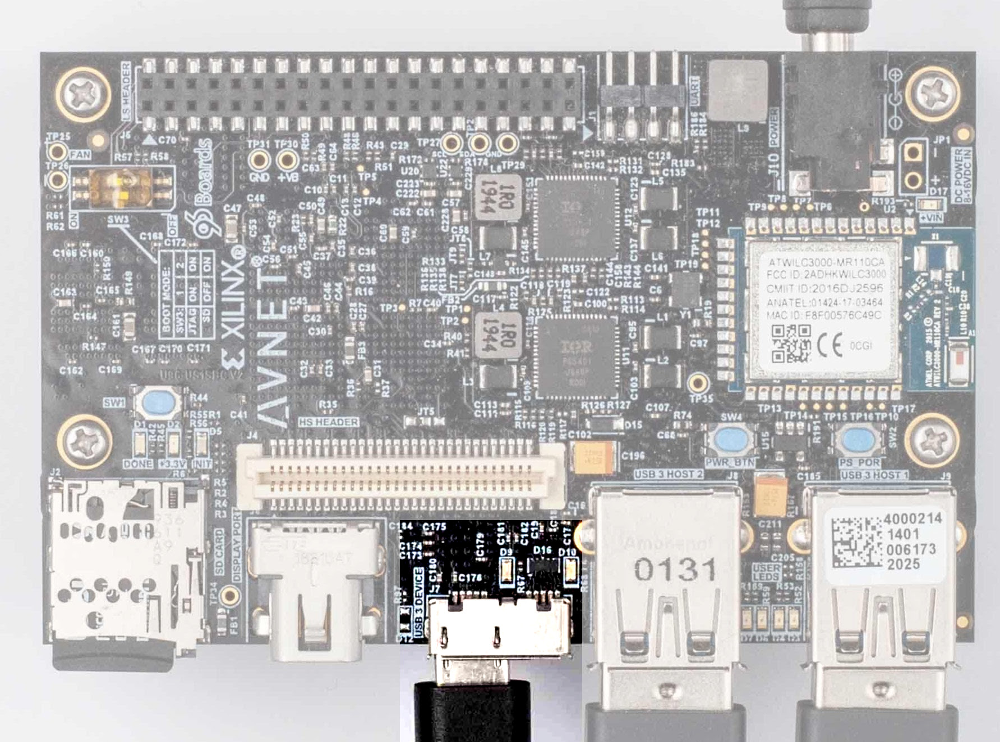

# PYNQ Image

## Downloading the Image

The PYNQ image for the Ultra96-V2 can be downloaded from http://www.pynq.io/board.html

Download the v3.0.1 image for the Ultra96V2, and extract the image from the zip file.

## Creating a SD card with the image

Download [Balena Etcher](https://www.balena.io/etcher/) to write the downloaded image to the SD card. 

Choose the image you've downloaded, the SD card, and start writing.

# Booting the System

Insert the microSD Card into the microSD card slot. The slot is highlighted in the image:



Make sure the SW3 is set to boot from SD card, as shown in the image:



Connect the power adapter.

Press the power button (SW4). The button is highlighted in the image:



The board will now boot from the image on the microSD card.

# Connecting to the Board

Connect a micro-USB (or micro-USB3) cable to the "USB 3 DEVICE" port. The port is highlighted in the image:



Once connected to a Linux or Windows machine, it will emulate a network adapter. The IP address of the board would be 192.168.3.1.

You can now connect to the board using SSH. The username is `xilinx` and the password is `xilinx` as well.

```
ssh xilinx@192.168.3.1
```

# Suggested Setup

## SSH Passwordless Login

Create a directory `~/.ssh`, and set its permissions as follows:

```bash
mkdir ~/.ssh
chmod 700 ~/.ssh
```

Copy your SSH public key to the same directory. For example, from a Linux machine, run

```bash
scp ~/.ssh/id_rsa.pub xilinx@192.168.9.3:.ssh/
```

Make sure the permissions are correct (on the board)

```bash
chmod 600 ~/.ssh/*
```

## `sudo` without a password

Everything that has to do with the PL requires root. It is annoying to repeatedly running `sudo` and typing the passowrd. You can make `sudo` work without a password as follows:

As `root`, create a file `/etc/sudoers.d/xilinx`, containing the line:

     xilinx ALL=(ALL) NOPASSWD: ALL

## WiFi

Follow these instructions to connect to WiFi
https://www.linuxbabe.com/ubuntu/connect-to-wi-fi-from-terminal-on-ubuntu-18-04-19-04-with-wpa-supplicant

Here's a short summary:

    wpa_passphrase "<Your ESSID>" "<Your Passphrase>" | sudo tee /etc/wpa_supplicant.conf
    sudo wpa_supplicant -B -c /etc/wpa_supplicant.conf -i wlan0
    sudo dhclient wlan0

This connection will last until the board is restarted.

## Automatically connect to WiFi at boot time

After running `wpa_passphrase` to create `/etc/wpa_supplicant.conf`, create the following two files


1. `wpa_supplicant.service`:
```
[Unit]
Description=WPA supplicant
Before=network.target
After=dbus.service
Wants=network.target
IgnoreOnIsolate=true

[Service]
Type=dbus
BusName=fi.w1.wpa_supplicant1
ExecStart=/sbin/wpa_supplicant -u -s -c /etc/wpa_supplicant.conf -O /run/wpa_supplicant -i wlan0

[Install]
WantedBy=multi-user.target
# Alias=dbus-fi.w1.wpa_supplicant1.service
```
2. `dhclient.service`:

```
[Unit]
Description= DHCP Client
Before=network.target

[Service]
Type=forking
ExecStart=/sbin/dhclient wlan0 -v
ExecStop=/sbin/dhclient wlan0 -r
PIDFILE=/var/run/dhclient.pid

[Install] 
WantedBy=multi-user.target
```

Copy the files into `/etc/systemd/system/` and run the following commands:

```
sudo systemctl enable wpa_supplicant.service
sudo systemctl enable dhclient.service
```
Now restart the board.
